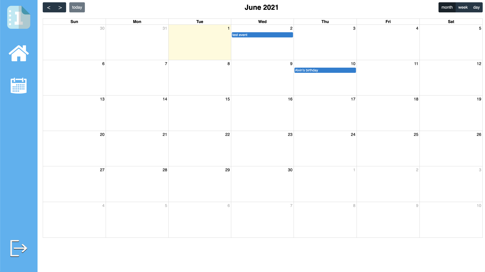
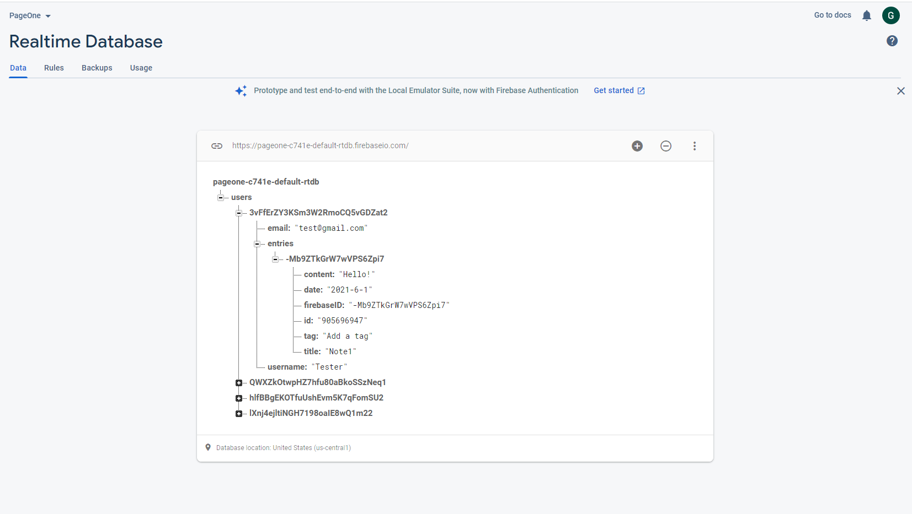
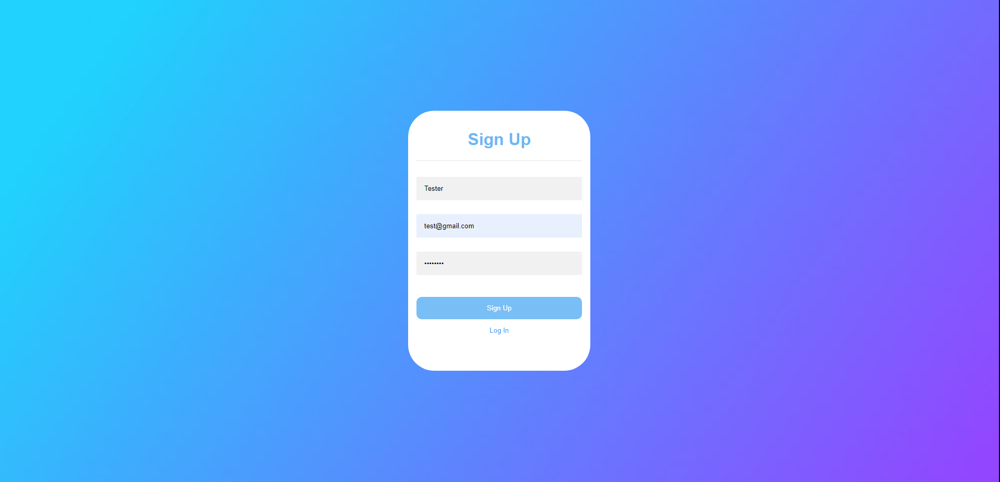
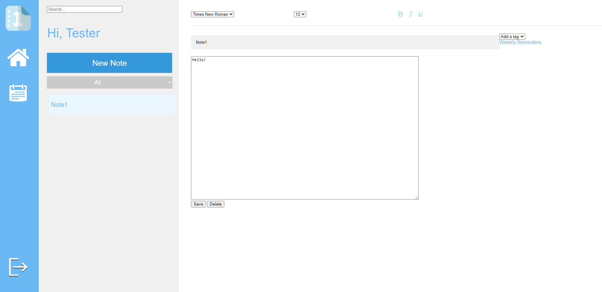
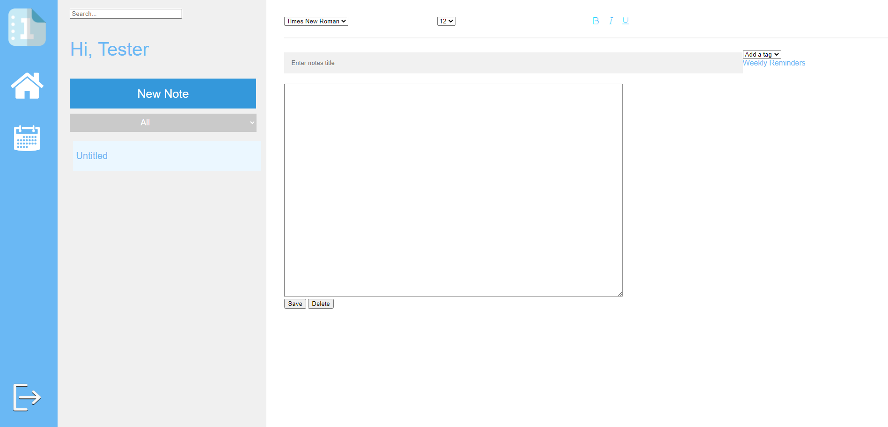

# Page One - Sprint Review Meeting #2 (06/01/2021)

**Type of Meeting:** Sprint Review Meeting

**Date:** June 01st, 2021 at 5:30PM

**Location:** Meeting conducted virtually over Zoom, Google Docs, and VSCode live share

## Attendance

**Present**
- Victoria Edeeva
- Geewhan Kim
- James Nguyen
- Alvin Mac
- Charles Ting
- Kyle Hu
- Brandon Wang
- Elias Fang

**Absent**
- Julia Xu

# Progress Report

## Calendar - Kyle and Brandon

Issues
- Some observations we found during testing
  - On open of an event note, does not automatically display the event tag with date picker
  - What are weekly reminders? Doesn’t display on the weekly reminders list, and also caution against using eventArr (centralization purposes)
- Whoever did the event datepicker, can they also add time and duration?
  - Start and end of event
  - Similar to google calendar

What we got done:
- Adds an event to calendar when a new event note is created
- Fixed an issue where tags were not saved on reload of notes
- Removed old code that still referenced by title instead of ID

For next time:
- Create an event handler for calendar event click that redirects to the note on the notes page

## Search/Reminders - James

Sprint Part 1:

Issues:
- Some formatting things were off but should be fixed within this sprint

What was worked on:
- Created search bar to filter through entries in notes
- Search will filter by title and update the notes list to contain notes that contain the searched word
- When the search bar is empty the notes list will reset to normal
- Created reminders tab on the right side of the page
- Reminders will take notes that are tagged as events and post them in the reminders tab
- Checks to see if the events are within the next week and will only add them if they are.

Sprint Part 2:
Issues:
- Found that tags and date of event were not being saved with the save button meaning that on reload the tag and event date would not display correctly.
- Search and reminders did not use the same array as the main notes array meaning that delete and save were not working properly
- Old indexing method meant that old code no longer worked the way that it did before.

What was worked on:
- Updated code to save tags and date of event so that it can redisplay properly when the note button is pressed.
- Added event date to array object so that reminders can store the event in the weekly reminders properly.
- Updated search bar and reminders code so that it works with the central array and the new indexing system.
- Looked over code to remove redundancies and unnecessary lines left over from previous iteration.

For next time: 
- Add event start and end times as needed for calendar events.

## Filter - Charles

Issues: 
- Filter needed to be fixed because we redid the structure of our code. We used a single main map to hold all of our notes.
- There was some old code causing errors because it was using the old tempArray

What we got done:
- Managed to fix the filter feature so that it now outputs the correct notes with the correct filtered tag.
- Fixed some of the errors using the old TempArray

For next time:
- Debug the filter feature more thoroughly

## Firebase Authentication - Geewhan and Elias

Issues:
- Signup and login button sends you to main page without login credentials
- Signup doesn’t actually create a new account

What we got done:
- Linked the signup/login with the firebase
- signup/login works as intended
- Hi User displays user name

## Firebase Database + Notes Buttons - Geewhan/Kyle/Charles/Alvin

Issues:
- New note button did not work as intended
- Did not have a delete button to delete notes
- No save button to save the notes
- Notes were not saved through the Firebase

What we got done:
- Created a save button (saves to Firebase)
- Created a delete button (deletes from Firebase)
- New note adds entry into the Firebase

For next time:
- Update Firebase with formatting implementation 

## Form Functionality - Charles & Alvin

Issues: 
- Bold only works partially. Italics and Underline are still unimplemented
- Size of the main body textbox does not adapt to window size
- The left half and right half still doesn’t scale correct to window size
- There’s only 1 font size and style

What we got done:
- Implemented a form for to input the title and the main body of the note
- Created buttons for each note
- Basic saving/loading notes

For next time:
- Finish implementing the formatting options
- Let the user start formatting once the button is clicked, not have the formatting change the entire input
- Load up different font styles and sizes
- Find a way to set a date for an event

**Meeting End: 6:10pm**

# Final Stretch: What needs to get done

- **Elias and Geewhan:** Todo List
- **Testing and Fixing Bugs:** To be assigned
- **James:** Reflections tag and Event Time (Start and End)
- **Julia:** Styling
- **Alvin and Charles:** Nestable bullets

Core Features that need to be completed:
- Logging for domain specific items (e.g. tasks, ~~events, & notes)~~
- Nestable bullets
- ~~Index/navigation~~
- ~~collections (grouping or searching by tags or category)~~
- ~~daily logs~~
- ~~future logs (e.g. monthly/weekly preview)~~

Decisions:
- Decided to skip text formatting (bold, italics, etc.) unless time permits
- Decided to have nestable bullets in the main notes since we are creating a BuJo (bullet journal)

# For Next Time

- Thursday 06/03 TA check in @ 7:00pm
- Next stand up meeting on Friday 06/04 @ 4:00pm
- Get ready to submit the final project on 06/10

